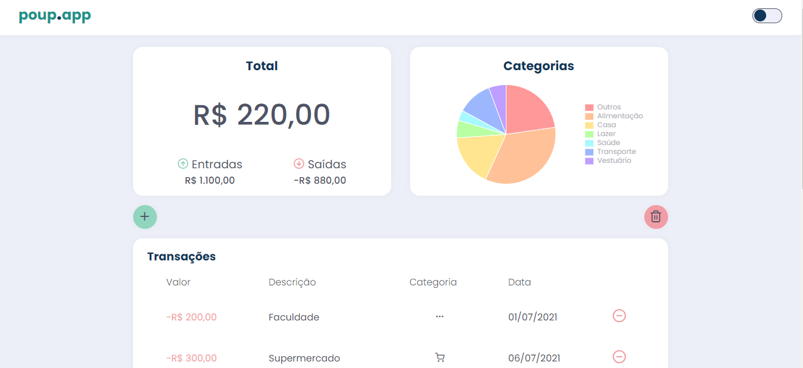
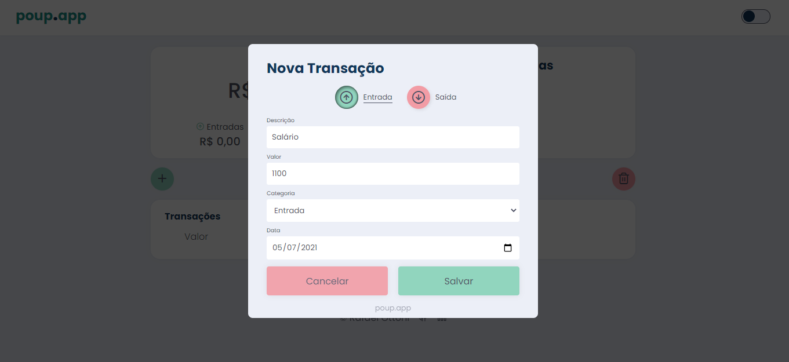
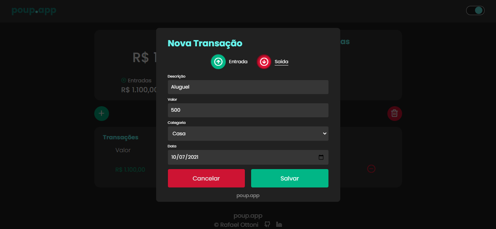
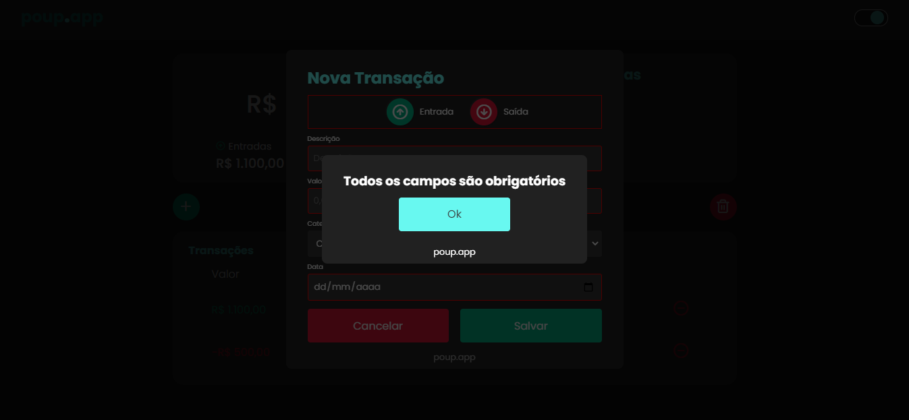

<h1 align="center">POUP.APP</h1>

<h3 align="center" ><a href="https://poupapp.netlify.app/">Site POUP.APP</a> </h3>

# Índice

• <a href="#objetivo">Sobre</a>
• <a href="#tecnologias">Tecnologias</a>
• <a href="#updates">Updates</a>

## Sobre

Consiste em um site para controle de finanças do usuário, onde são colocadas as entradas e saídas, juntamente com suas datas e o site calcula o saldo total.
Ideal para organização financeira, onde o usuário saberá o que gastou e quando gastou de forma fácil e acessivel.

## Tecnologias

As seguintes ferramentas foram usadas na construção do projeto:

- [JavaScript](https://www.javascript.com/)
- HTML
- CSS

## Updates

Projeto foi desenvolvido na Maratona Discover da Rocketseat, com a mentoria do professor Mayk Brito. E com intuito de melhorar meu aprendizado e poder evoluir farei modificações e atualizações de acordo com meu conhecimento.

- [x] Modificar nome e cores
- [x] Adicionar cor vermelha no card total se o saldo for negativo
- [x] Personalizar mensagem de erro
- [x] Adicionar modo escuro
- [x] Acrescentar um botão "Excluir tudo"
